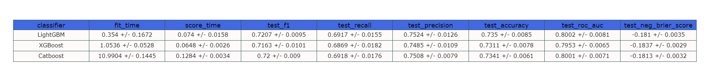
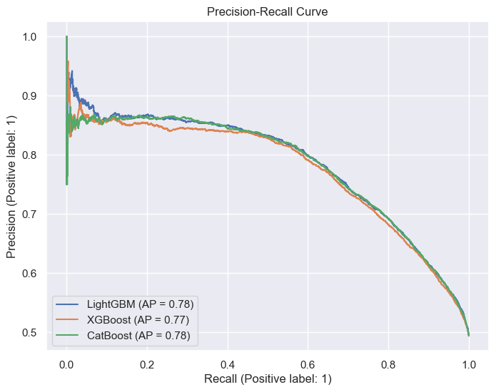
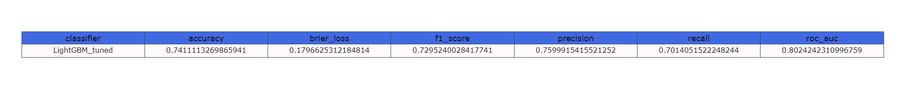
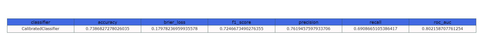

# Cardio Catch Disease Project

 
 

&nbsp;

## The objective of this project is to develop a tool to predict heart disease at early stages with a good and stable precision to bring more profit for the company.

&nbsp;

## Summary
* [1.0. Business Problem](#10-business-problem)

* [2.0. Bussiness Assumptions](#20-business-assumptions)
    * [2.1. Data](#21-data)

* [3.0. Solution Strategy](#30-solution-strategy)

    * [3.1. Data Description](#31data-description)
    * [3.2. Feature Engineering](#32-feature-engineering)
    * [3.3. Data Filtering](#33-data-filtering)
    * [3.4. Exploratory Data Analysis](#34-exploratory-data-analysis)
    * [3.5. Data Preparation](#35-data-preparation)
    * [3.6. Feature Selection](#36-feature-selection)
    * [3.7. Machine Learning Modeling](#37-machine-learning-modeling)
    * [3.8. Hyperparameter Fine Tuning](#38-hyperparameter-fine-tuning)
    * [3.9. Model Calibration](#39-model-calibration)
    * [3.10. Convert Model Performance to Business Values](#310-convert-model-performance-to-business-values)
    * [3.11. Deploy Model to Production](#311-deploy-model-to-production)

* [4.0. Exploratory Analysis](#40-exploratory-analysis)
    * [4.1. Top 3 Data Insights](#41-top-3-data-insights)

* [5.0. Machine Learning Models](#50-machine-learning-models)
    * [5.1. Model Compariso](#51-model-comparison)
    * [5.2. Three Best Models Comparison](#52-three-best-models-comparison)

* [6.0. Business Results](#60-business-results)
    * [6.1. Business Results](#61-tuned-models)
    * [6.2. Business Results](#62-calibrated-model)

* [7.0. Business Results](#70-business-results)
    * [7.0. Current Business Performance](#71-current-business-performance)
    * [7.0. Business Results](#72-business-performance---new-model)

* [8.0. Conclusions](#80-conclusions)

* [9.0. Lessons Learned](#90-lessons-learned)

* [10.0. Lessons Learned](#100-next-steps-to-improve)

# 1.0. Business Problem.

Cardio Catch Disease is a fictional company that is specialized in heart disease detection at its early stages. Its business model is a service — the company offers early heart disease diagnostics for a specific price.

**Currently Scenario**

    The heart disease diagnostic is made manually by a team of specialists. The precision is between 55% and 65% because of the complecity of the diagnosis process, and the team's fatigue. The cost of each diagnostic, including equipement and payment sheet, is around $900,00.

    The price of the diagnostics varies with the precision achived by the team of specialists. It works like this: for every 5% precision above 50%, the customer pays $500.00. If the diagnostic has a precision of 55%, the customer pays $500.00; for a precision of 60%, the customer has to pay $1000.00, and so on. If the precision is 50% or lower the customer doesn't have to pay.

    The problem is that the team's precision is highly variable (range of 10%), making the business unstable. In the worst-case scenario (55% precision), the company has a $400.00 loss. In the best-case (65% precision), it has a $600.00 revenue.

**Solution**

    We can use machine learning to develop a model to help the team's diagnostics, improving its precision and giving more stability.

# 2.0. Business Assumptions.

    - The feature alco (Alcohol intake) means that the person consumes alcohol regularly.
    - Active -> The person regularly practices some physical activity.

    Blood Pressure:

    It is not possible to have a blood pressure below zero. Also, the diastolic pressure can't be higher than the systolic pressure.
  
    For the gender variable, we assume that 1 means female and 2 means male.

## 2.1. Data
Attribute|Description|Type|Unit
----|-------------------|-----|----------
age | Age | Objective Feature | int (days)
| height | Height | Objective Feature | int (cm) |
| weight | Weight | Objective Feature  |float (kg) |
| gender | Gender | Objective Feature  |categorical code |
| ap_hi | Systolic blood pressure | Examination Feature | int |
| ap_lo | Diastolic blood pressure | Examination Feature | int |
| cholesterol | Cholesterol | Examination Feature | 1: normal, 2: above normal, 3: well above normal |
| gluc | Glucose | Examination Feature  |1: normal, 2: above normal, 3: well above normal |
| smoke | Smoking | Subjective Feature | binary |
| alco | Alcohol intake | Subjective Feature  |binary |
| active | Physical activity | Subjective Feature | binary |
| cardio | Presence or absence of cardiovascular disease | Target Variable | binary |

&nbsp;

# 3.0. Solution Strategy

My strategy to solve this challenge was:

## 3.1. Load the Data & Data Description

First, the data was obtained from [kaggle](https://www.kaggle.com/datasets/sulianova/cardiovascular-disease-dataset), then a part of the data was selected for the test set.
After that, I checked the number of instances on the data and possible inconsistencies like missing values, data types, and duplicates. I also used some descriptive statistics to have an overview of the data.

**Summary Table**

&nbsp;

**Histograms** 

&nbsp;

## 3.2. Feature Engineering

New features were created for Exploratory Analysis and to test in the Machine Learning process.

## 3.3. Data Filtering

Removed some instances based on business restrictions and some inconsistencies.

Instances where:

- The systolic or diastolic pressure is too high (not possible values).
- The Systolic pressure is lower than the diastolic pressure.
- Absurd values for the height variable.

## 3.4. Exploratory Data Analysis

- Univariate analysis was made using pandas profiling.
- Hypothesis Validation
- Checked correlation between features.

**Hypothesis Mind Map**

## 3.5. Data Preparation

In this step, I created pipelines to prepare the data to train the model using the `Pipeline` and `ColumnTransformer` methods from the sklearn library.

## 3.6. Feature Selection

The selection of features was made using `BorutaPy` from the `boruta` library.    

## 3.7. Machine Learning Modeling

Here, Multiple tests with different scenarios were made to compare the performances of different models. The models were trained with and without scaling the continuous variables, using the features selected by BorutaPy, and using all the features.

After that, the three models with the best performances were picked for a deeper analysis of them and to compare their general performances using cross-validation.

## 3.8. Hyperparameter Fine Tuning

After picking the model with the best performance from the top 3 of the previous section, `optuna` — a library of optimization — was used to tune the hyperparaments.

## 3.9. Model Calibration

After fine tuning, I calibrated the model and checked the model's performance.

## 3.10. Convert Model Performance to Business Values

Using the test data, we assess the business performance if the model is implemented. The model's precision confidence interval (95%) was calculated to estimate the worst and best-case scenarios for the business.

## 3.11. Deploy Model to Production

API implemented on render cloud.

Built a Google Sheets script to request the API, with a click on a button, and return the probabilities predictions. This way, people have easy access to the model's predictions. We also can use this as a test environment, adding new data and changing some attributes to see how the results changes.

# 4.0 Exploratory Analysis

**Histograms After Data Filtering**

&nbsp;

## 4.1 Top 3 Data Insights

&nbsp;

**Hypothesis 01:** The proportion of people with cardio disease is 30% higher among people older than 50.

FALSE: The proportion of people above 50 years old and that have heart disease is 14% higher than the overall proportion, and 54.9% higher than those below 50 years old.

&nbsp;

**Hypothesis 02:** Overweight people correspond to 30% of the patients with heart disease.

TRUE: Approximately 36% o people with heart disease, but we have a similar proportion for people who don't have a cardio disease.

&nbsp;

**Hypothesis 03:** Of the people with heart disease, 65% have high blood pressure

TRUE: 64% of people with heart disease have a high blood pressure level.

&nbsp;

# 5.0. Machine Learning Models

## 5.1 Model Comparison

Final table after testing the models on different scenarios.

&nbsp;

## 5.2 Three Best Models Comparison

### **Cross-Validation Metrics**

XGBoost has the worst performance of the three models. LightGBM and CatBoost had very similar results; LightGBM has a slightly better f1-score with a lower fit time, as shown in the table below.

&nbsp;

### **ROC Curve**

In this graphic, we can observe that LightGBM and CatBoost ROC curves overlap for the most part. And the XGBoost ROC curve is below both of those.

&nbsp;

### **Precision-Recall Curve**

&nbsp;

# 6.0. Machine Learning Model Performance

## 6.1 Tuned Model

&nbsp;

### **Confusion Matrix**

 

### **ROC Curve**

### **ROC Precision-Recall Curve**

### **Calibration Plot**

### **Metrics**

## 6.2 Calibrated Model

### **Calibration Comparison**

Visually, the calibrated model seems better for probabilities below 50%. For probabilities above 50%, the original classifier looks a bit better than the calibrated one.

### **Confusion Matrix**

### **Metrics**

The calibrated classifier has better precision, but the other metrics are worse. Also, the calibration metric (brier score loss) didn't improve, so the tuned model was chosen as the final model.

&nbsp;

# 7.0. Business Results

Here we can see the worst and best-case scenarios for the business in the current diagnostic process and in the proposed solution with machine learning.

## 7.1. Current Business Performance

 

## 7.2. Business Performance - New model

The worst scenario for the new solution is better than the best scenario of the current process. If implemented, the new process will have a $1100.00 profit per diagnostic in the worst-case scenario. Whilst the current process has a profit of $600.00 per diagnostic in the best case, which means at least an 83.33% increase in profit per diagnostic. 

&nbsp;

# 8.0. Conclusions

In this project, a machine learning model (classifier) was built to help the team of specialists in heart disease diagnosis. The model has a precision of 0.759 - 95% CI [0.747, 0.772]. Since the diagnostic price depends on its precision, compared with the current situation (55-65%), we expect at least an 83.33% increase in profit per diagnostic.

&nbsp;

# 9.0. Lessons Learned

- Heart diseases and some risk factors.
- How to use Pipeline to make a neater code.
- The Proper way to separate the data into train and test sets.
- How to use metrics to evaluate a binary classifier.

# 10.0. Next Steps to Improve

- Improve the Google Sheets scripts with error treatment, and allow the user to run the script only for selected rows.
- Use Hypothesis tests on the Exploratory Analysis.
- Use statistical methods to compare the classifiers performances.

# Google Sheets

&nbsp;

#### This project was made by Breno Teixeira.